# 🐭 Mouse Behavior Analysis Platform

DeepLabCut 포즈 추정 좌표 데이터를 기반으로 마우스 Open Field(Yohimbine) 행동을
자동 분석하고, 행동 강도 정량화 · 통계 분석(LME) · 시각화를 제공하는
**웹 기반 행동 분석 시스템**입니다.

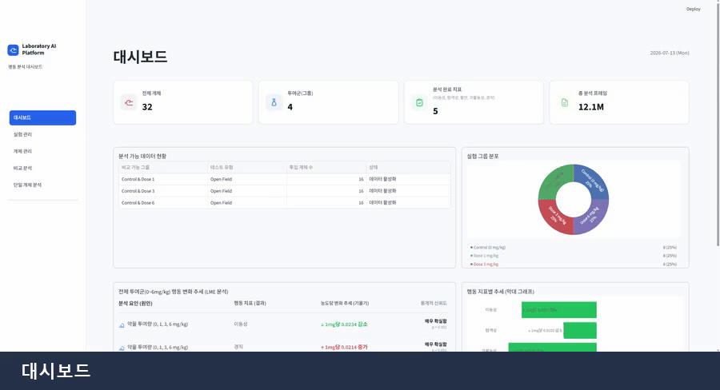

> 실제 앱 데모 — 대시보드 → 실험 관리 → 개체 관리 → 단일 개체 분석(영상+행동 타임라인)
> → 그룹 비교 분석(LME·Cohen's d) 순으로 둘러봅니다.

---

## 1. 프로젝트 소개

- **목적**: 영상 기반 행동 실험(Open Field Test)의 분석을 수작업 관찰에서
  **좌표 데이터 기반 자동 정량화**로 전환합니다.
- **해결하려는 문제**: DeepLabCut이 산출한 프레임 단위 좌표(x, y)는 그 자체로는
  "얼마나 불안한지", "얼마나 활동적인지"를 말해주지 않습니다. 이 원시 좌표를
  **해석 가능한 행동 지표로 변환**하고, 투여군(Dose) 간 차이를 통계적으로 검증합니다.
- **핵심 기능**: 행동 Feature 추출 → 5종 행동 강도 점수화 → 선형 혼합 효과 모델(LME)
  기반 그룹 비교 → Streamlit 대시보드 시각화.

---

## 2. 주요 기능

| 화면 | 기능 |
|------|------|
| 📊 Dashboard | 전체 개체·투여군 요약, 행동 지표 개요 |
| 🧪 실험 관리 | 실험 데이터 목록 및 메타데이터 관리 |
| 🐭 개체 관리 | 개체(마우스) 목록·투여군 관리 |
| 🔬 비교 분석 | 그룹 간 비교, LME 결과, Cohen's d 효과크기 |
| 🔎 개체 상세 | 개체별 행동 타임라인·통계 (영상 업로드 시 동기화) |

- 행동 Feature 추출 (운동학 · 공간 · 형태)
- 행동 지표 계산 (5종 연속 강도 점수)
- LME(Linear Mixed Effects) 분석
- 그룹 간 비교 / 개체별 분석
- 그래프 및 리포트 출력

---

## 3. 시스템 아키텍처

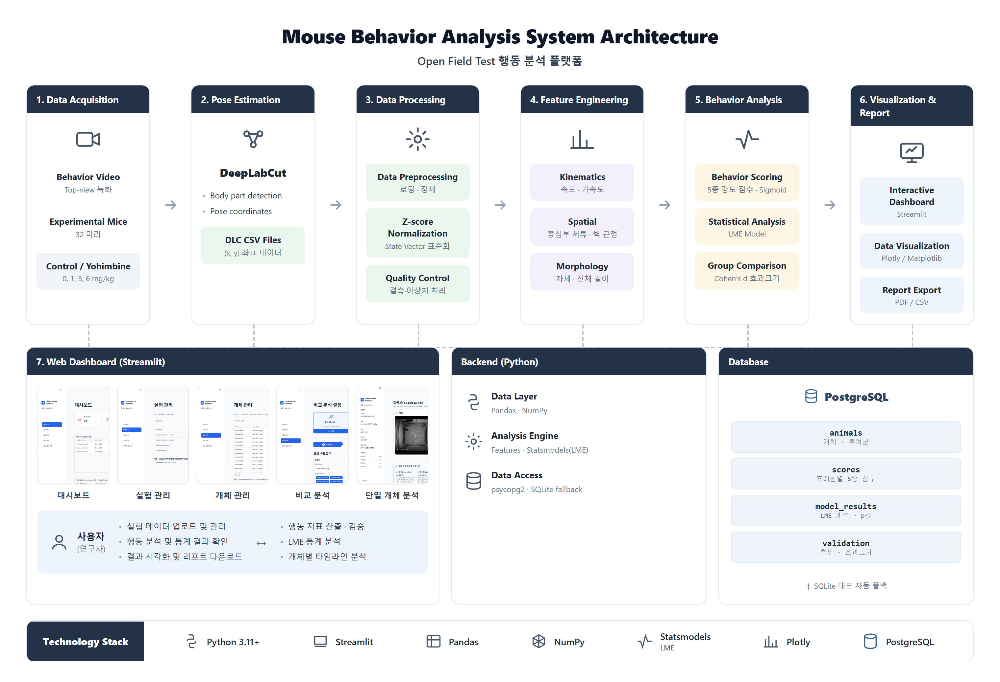

> 데이터 수집(Video) → 포즈 추정(DeepLabCut) → 데이터 처리 → 특성 추출 → 행동 분석(LME)
> → 시각화의 흐름이 Streamlit 웹 대시보드로 제공되며, PostgreSQL(데모 시 SQLite 폴백)에
> 개체·점수·모델결과·검증 결과가 적재됩니다. *(하단 대시보드 화면은 실제 앱 캡처)*

---

## 4. 기술 스택

| 분류 | 기술 |
|------|------|
| Language | Python 3.11+ |
| Dashboard / UI | Streamlit |
| 데이터 처리 | Pandas, NumPy, SciPy |
| 통계 분석 | Statsmodels (LME), scikit-learn |
| 시각화 | Plotly, Matplotlib, Seaborn |
| Database | PostgreSQL (라이브) / SQLite (데모 폴백) |

---

## 5. 프로젝트 구조

```text
my_project/
├── main.py                  # 전체 분석 파이프라인 실행 진입점
├── generate_plots.py        # 분석 결과를 바탕으로 시각화 차트를 생성하는 스크립트
├── pyproject.toml           # Python 프로젝트 설정 파일
├── requirements.txt         # 패키지(Python 패키지) 의존성 목록
├── METADATA_ROCHE.csv       # 실험 개체 및 투여군 정보가 담긴 메타데이터
├── 데이터 사용 출처.txt     # 데이터셋 원본 출처 및 라이선스 정보
├── config/                  # 설정 디렉터리 (CSV 포맷, 데이터베이스, LME 모델, 플롯 관련 설정)
├── dashboard/               # Streamlit 기반 웹 대시보드 애플리케이션
│   ├── app.py               # 대시보드 구동을 위한 메인 실행 파일 (엔트리 포인트)
│   ├── pages/               # 개별 화면 모듈 (01_dashboard ~ 05_mouse_detail)
│   └── sample_data/         # 데모 실행을 위해 내장된 SQLite 샘플 데이터베이스
├── src/                     # 핵심 행동 분석 파이프라인 소스 코드
│   ├── data/                # DeepLabCut CSV 데이터 로더 및 결측치 전처리
│   ├── features/            # 행동 특성 지표 추출 (운동학, 공간 점유, 형태학적 자세)
│   ├── state/               # 특성 데이터의 단위 통일을 위한 Z-score 정규화 및 State Vector 구성
│   ├── scoring/             # 행동 특성 기반 5종 연속 강도 점수 산출 (0~1 범위화)
│   ├── analysis/            # 통계 분석(LME 선형 혼합 효과 모델) 및 비교 분석 로직
│   └── validation/          # 투여량에 따른 추세 검정 및 효과크기(Cohen's d) 통계 검증
├── db/                      # 데이터베이스 연동 및 관리
│   └── schema.py            # 스키마 정의 및 라이브 DB(PostgreSQL) ↔ 데모 DB(SQLite) 자동 전환(폴백) 처리
├── scripts/                 # 부가 유틸리티 및 실행 스크립트
│   ├── build_sample.py      # 분석 완료된 데이터베이스에서 샘플 SQLite DB를 추출하는 스크립트
│   └── run_demo.py          # 데모 모드로 대시보드를 바로 실행하는 유틸리티
├── outputs/                 # 분석 파이프라인 최종 산출물 저장소 (점수화 차트 PNG, 통계 요약 CSV 등)
├── static/                  # 웹 UI 및 문서에 사용되는 정적 리소스 (아키텍처 다이어그램, ERD, 스크린샷 파일)
└── tests/                   # 코드 무결성 검증을 위한 유닛 테스트 모음 (분석 알고리즘, 상수 검증 등)
```

---

## 6. 데이터셋

- **실험**: Open Field Test (Top-view)
- **개체**: Mouse 32마리
- **투여군 (4개, 그룹당 8마리)**:
  - Control (0 mg/kg)
  - Yohimbine 1 mg/kg
  - Yohimbine 3 mg/kg
  - Yohimbine 6 mg/kg
- **메타데이터**: `Animal ID, DLC file, Group, Dosage, Video`
  (성별·나이·체중 정보는 원 데이터셋에 미포함)

> **출처**: Raw video and pose estimation data of top-view open field mouse
> behavior recordings after yohimbine injections
>
> ⚠️ 원본 영상(`Videos/`)과 원천 DLC 데이터(`data/`)는 용량·연구데이터 사유로
> `.gitignore` 처리되어 저장소에 포함되지 않습니다.

---

## 7. 분석 파이프라인

`main.py` 실행 시 6단계 계층으로 순차 처리됩니다.

```
Video
   ↓
DeepLabCut Pose Estimation
   ↓
[1] Data Layer        DLC 좌표 로드 · 전처리
   ↓
[2] Feature Layer     운동학(속도·가속도) · 공간(중심부 체류·벽 근접) · 형태(자세)
   ↓
[3] State Layer       Z-score 정규화로 개체 간 스케일 통일
   ↓
[4] Scoring Layer     도메인 가중치 + Sigmoid → 5종 강도 점수 (0~1)
   ↓
[5] Analysis Layer    LME 혼합모델 피팅 + 시각화
   ↓
[6] Validation Layer  추세 검정 · Cohen's d 효과크기 검증
   ↓
Database → Streamlit Dashboard
```

**행동 강도 점수 5종**: Locomotion(이동성) · Exploration(탐색성) ·
Anxiety(불안) · Hyperactivity(과활동성) · Freezing(경직)

> 점수 가중치는 학습이 아닌 **동물 행동학 도메인 지식** 기반으로 설계했으며,
> 강도 지표 특성상 상한이 있는 **Sigmoid** 변환을 채택했습니다.

---

## 8. 화면 (Screenshots)

**대시보드** — 전체 개체·투여군 요약, 그룹 분포, 행동 지표 개요
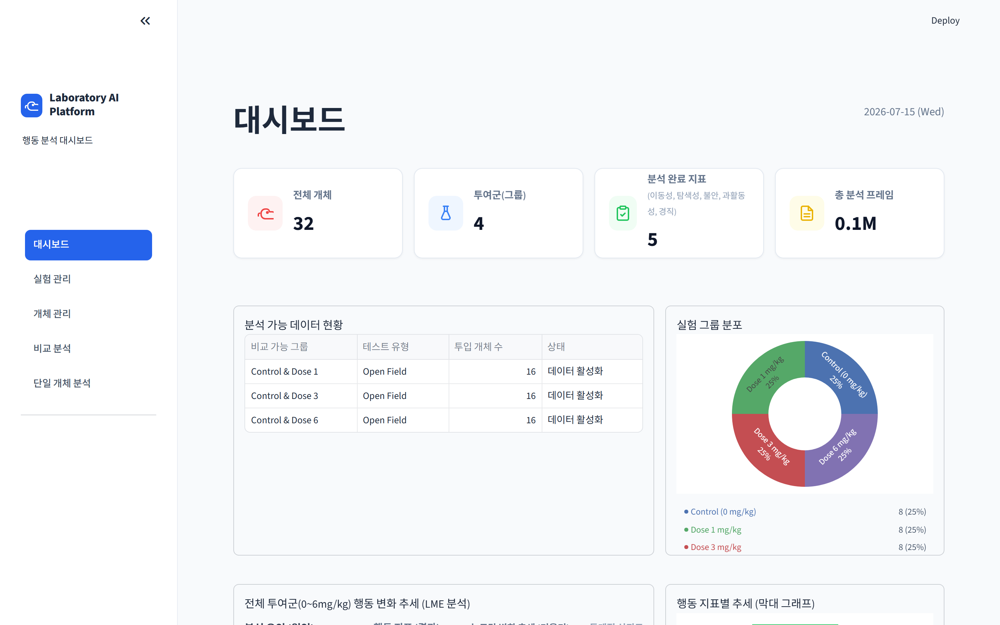

**실험 관리** — 실험 목록·상태 관리, 통계 분석 실행
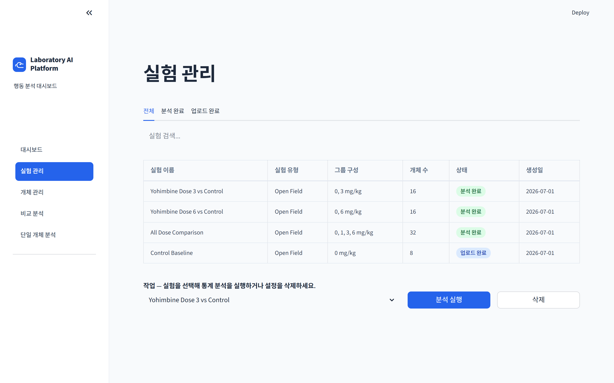

**개체 관리** — 32개체 목록, 그룹·행동 지표 요약, CSV 내보내기
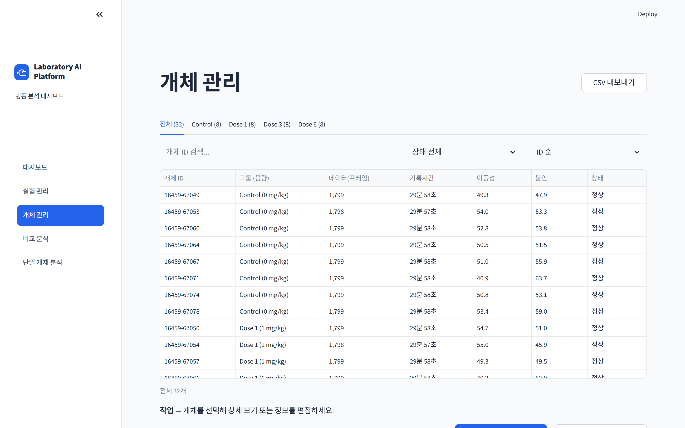

**비교 분석** — 그룹/개체/시간대 비교, LME·Cohen's d
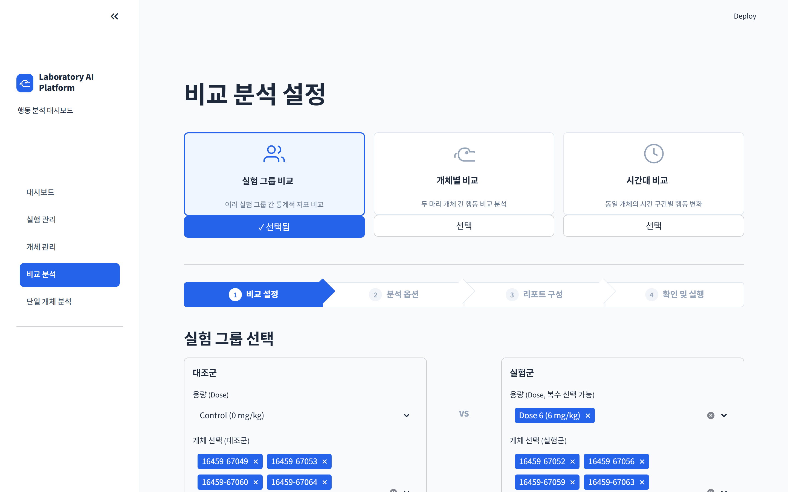

**단일 개체 분석** — 영상 + 행동 타임라인 동기화, 지표 정의
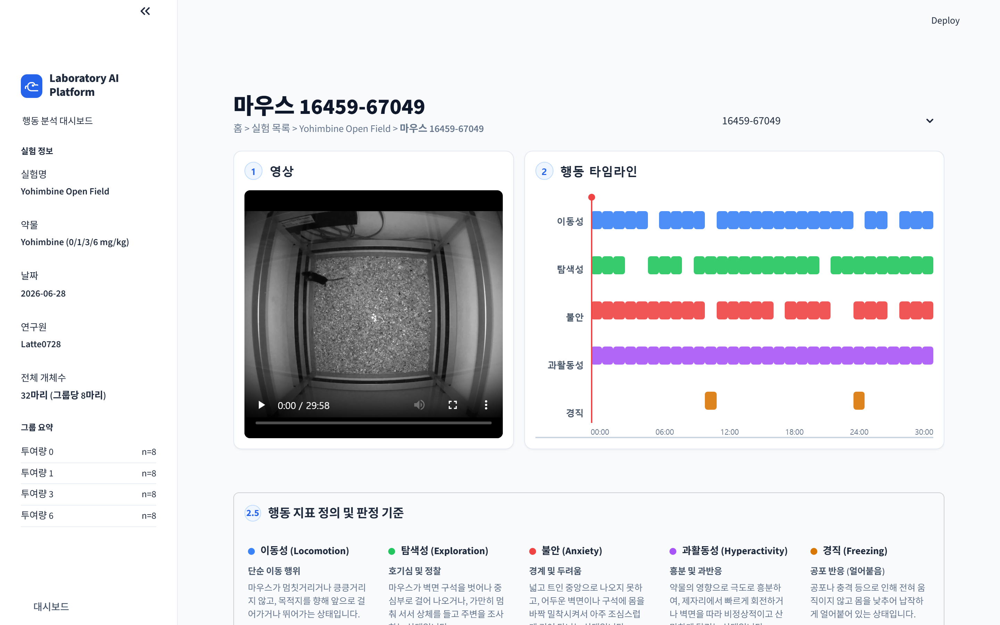

---

## 9. 결과 (Results)

`main.py` 실행 시 `outputs/` 에 분석 산출물이 저장됩니다.

**투여량-반응 곡선 (불안 지표)**
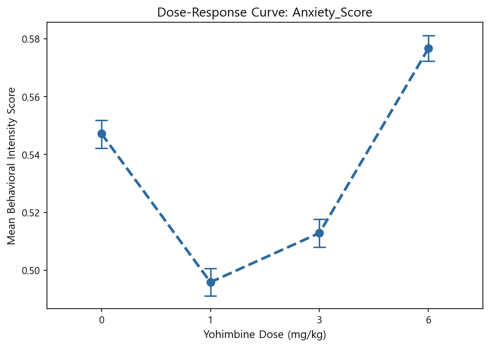

**공간 점유 Heatmap · 이동 궤적**
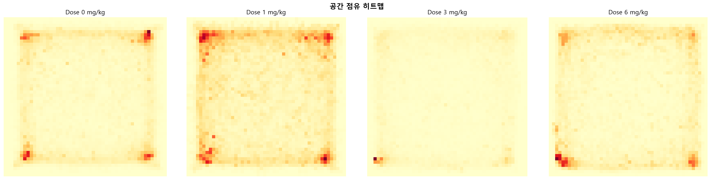
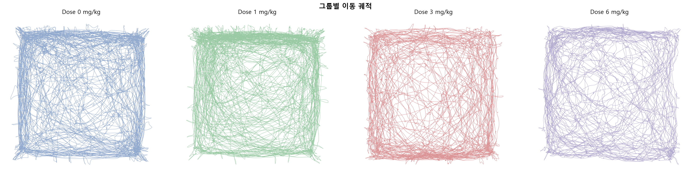

그 외 산출물:

- **시간축 연속 점수**: `outputs/continuous_*.png` (행동 5종)
- **점수 분포**: `outputs/distribution_*.png`
- **LME 결과 요약**: `outputs/mixed_model_summary.csv` (dose/time 계수·p값)
- **효과크기 / 추세 검정**: `outputs/effect_size.csv`, `outputs/trend_test.csv`

---

## 10. 실행 방법

### 빠른 실행 (DB·영상 없이 바로 재현)

```bash
git clone <repo-url>
cd my_project
pip install -r requirements.txt
streamlit run dashboard/app.py
```

> 저장소에 **SQLite 샘플 DB**(`dashboard/sample_data/behavior_sample.db`)가 포함되어
> PostgreSQL 설치 없이도 모든 화면이 동작합니다. 앱은 PostgreSQL 연결을 먼저 시도하고
> 실패 시 자동으로 샘플 DB로 폴백합니다. (`BEHAVIOR_FORCE_SQLITE=1` 로 데모 모드 강제)

### 전체 파이프라인 재실행 (원천 데이터 보유 시)

```bash
python main.py                  # 전처리→특성→스코어링→LME→검증→DB 적재
python scripts/build_sample.py  # DB 스냅샷 → SQLite 샘플 재생성
```

DB 접속 정보는 환경변수로 재정의: `PGHOST, PGDATABASE, PGUSER, PGPASSWORD`

---

## 11. 향후 개선 사항

- [ ] 추가 행동 지표 지원
- [ ] 다양한 행동 실험(EPM, Y-maze 등) 적용
- [ ] AI 기반 행동 분류 모델 연동 (도메인 가중치 → 데이터 기반 학습으로 확장)

---

## 참고: 데이터베이스 스키마 (ERD)

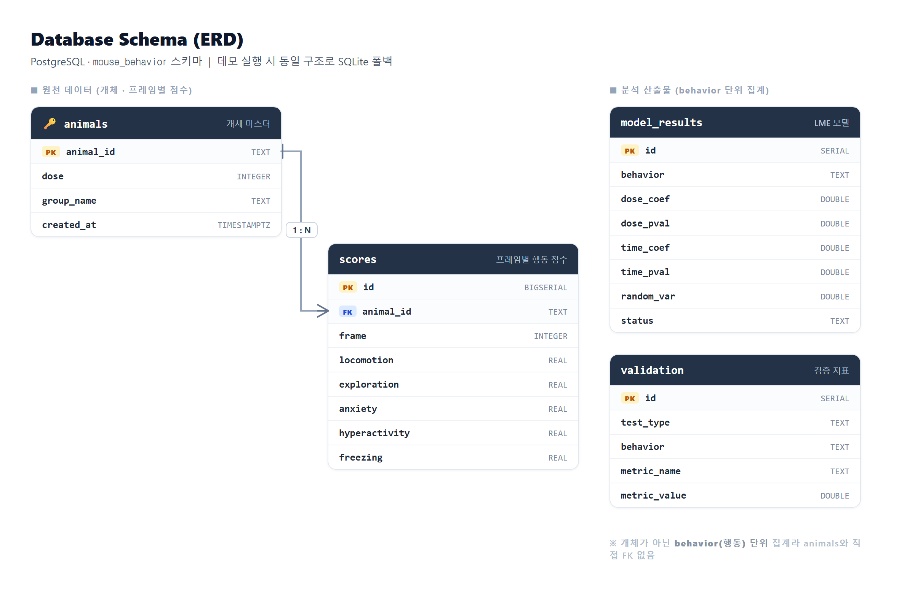

- **animals** (개체 마스터) ─1:N─ **scores** (프레임별 5종 행동 점수) — `animal_id` FK 연결
- **model_results** — 행동별 LME 계수·p값, **validation** — 추세 검정·효과크기 (통계 산출물)
- PostgreSQL `mouse_behavior` 스키마 기준이며, 데모 실행 시 동일 구조로 SQLite에 폴백됩니다.
